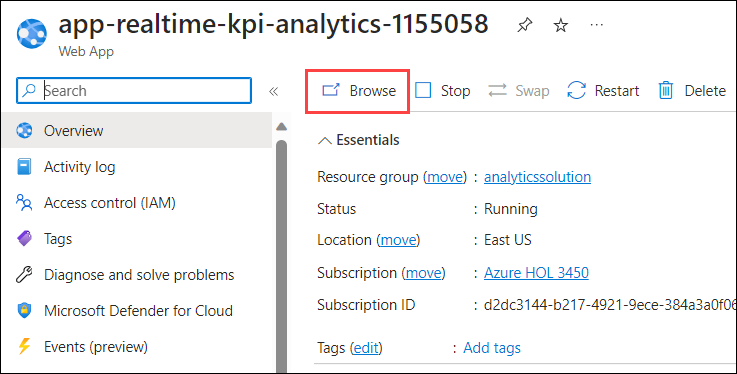
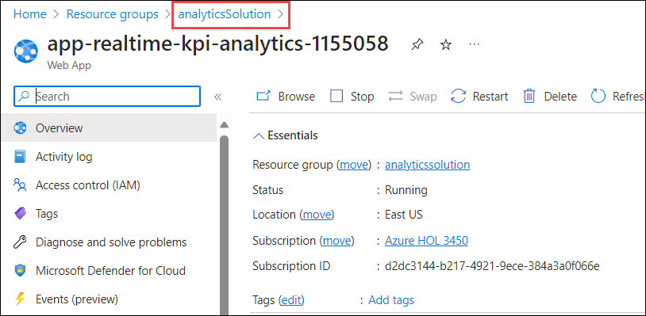
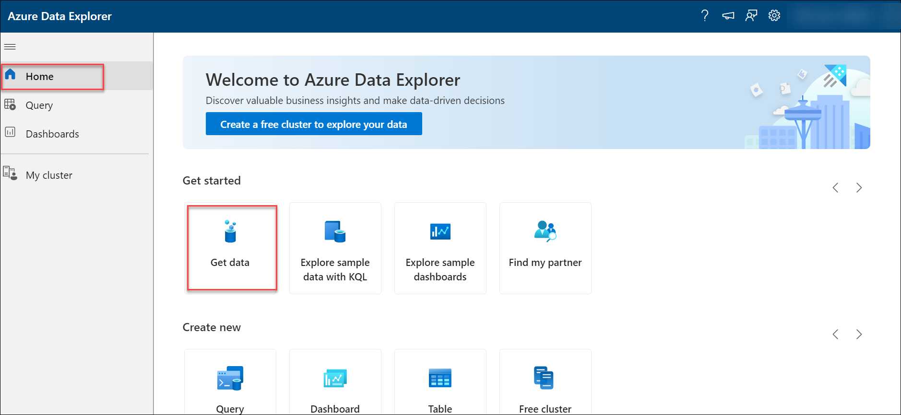
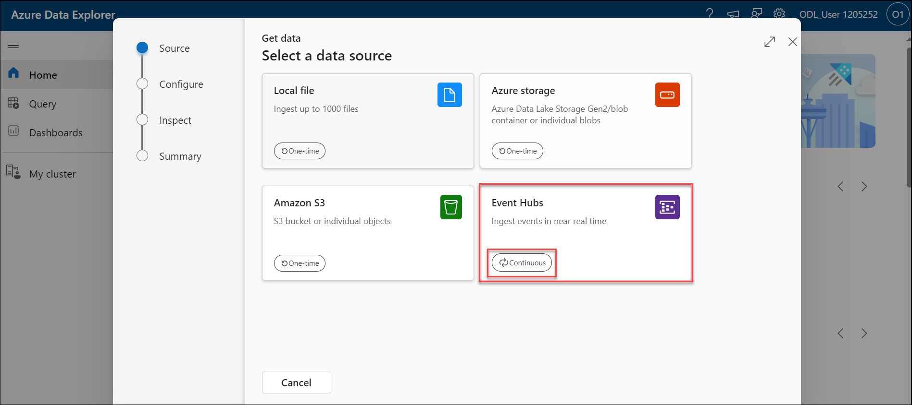
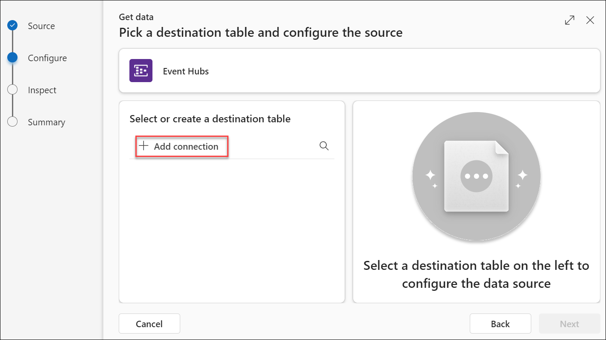
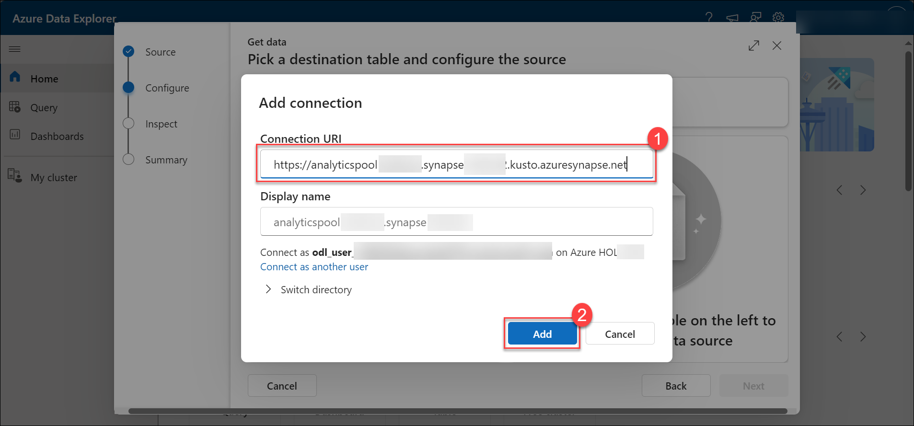
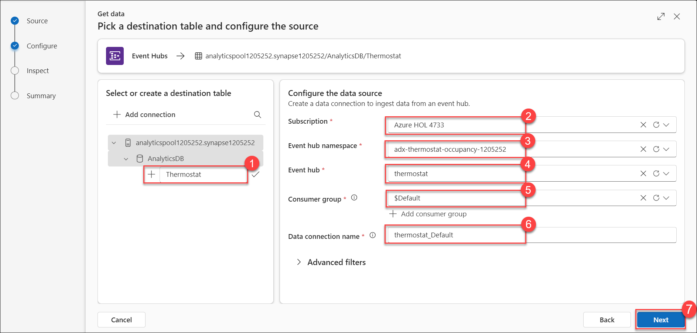
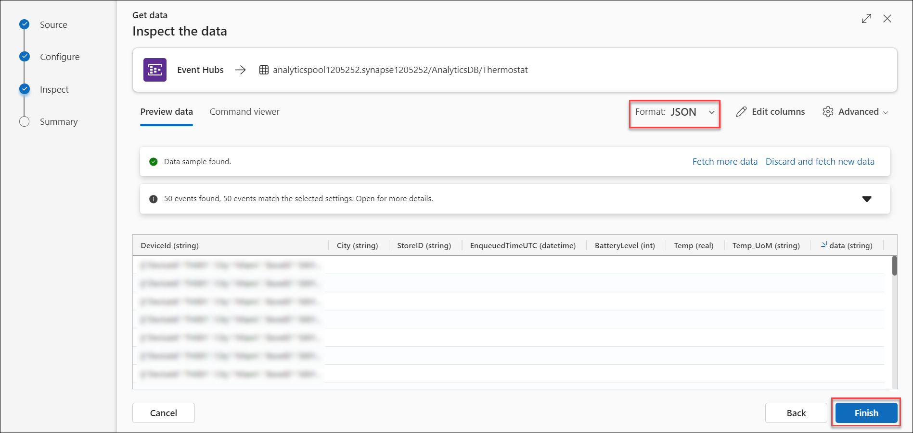
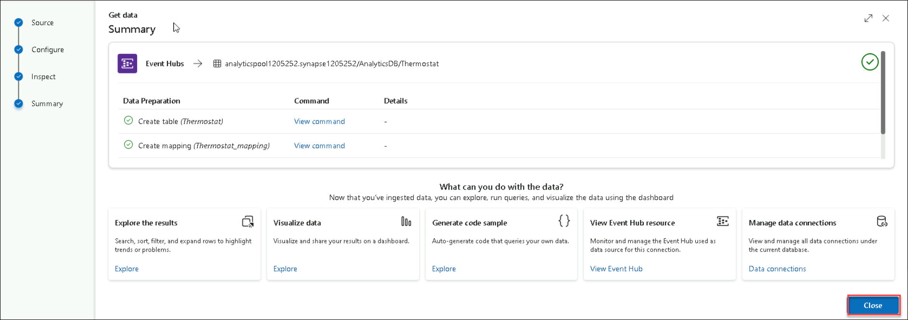

### Exercise 1: Data ingestion from a spectrum of analytical and operational data sources into the Lakehouse. 

As a data engineer at Wide World Importers, you will start by landing data from a variety of sources into the Lakehouse. This data will be further cleansed, processed, and confirmed by using Azure Databricks and Delta Live Tables. This is a preparation step for the downstream consumption of the data by data scientists and business intelligence analysts. Data sources include data related to its customers, products, marketing campaigns, social media, and sales transactions. This data is often generated in raw file formats such as CSV, JSON, unstructured files, and even images. A lot of the existing data is historical as well.

To boost customer satisfaction, gain a competitive advantage, and ultimately drive revenue growth, Wide World Importers wants to analyze its data to obtain meaningful insights related to their customers, marketing campaigns, and sales forecasts. However, their immediate challenge is to generate and use near real-time streaming data. So, they installed IoT devices in their stores to analyze customer shopping patterns and thermostat readings. They also set up Azure Data Explorer (ADX) with anomaly detection to correlate in-store traffic and store temperatures. As a result, they now have a large volume of real-time streaming data related to in-store traffic, temperature readings and anomaly detection.

In this exercise, you will explore how to ingest near real-time data into the Lakehouse and derive meaningful insights from them.

#### Task 1.1: Explore a Streaming data and analytics pipeline using ADX for a near real-time analytics scenario. 

Wide World Importers wants its customers to have a pleasant in-store shopping experience. Maintaining the optimal temperature in stores and wine coolers is one way to accomplish this objective.

Consider that the Black Friday Sale in-store event has just started at 6:00 AM EST, and customers are arriving in large numbers at the Miami store. As described earlier, thermostat data from the stores is streamed in real-time to an Azure Event Hub and then into an Azure Data Explorer (ADX) pool for analysis.

In this task, you will use ADX to explore thermostat data from the stores streamed in near real-time to an Azure Event Hub.

1. In the search results pane, select **Resource groups**.

    

2. In the **Resource groups** page, in the filter box, enter: **analyticsSolution**.

3. In the filtered results, select the resource group that has a name starting with **analyticsSolution**.

    

4. In the resources filter box for resources, search for **app**.

5. In the filtered results, select the **App Service**.

    

6. Select **Browse** (on the top left). This action will start the data simulation required to execute this task successfully (this will take 3-5 mins).

   

   And, this will take you to a webpage that will confirm **Data Simulation** has started:

    

7. Return to the Azure Portal session by selecting the resource group from the top navigation bar.

   

8. In the resources filter box for resources, search for **Synapse**.

9. In the filtered results, select the **Azure Synapse Workspace**.

    

   >**Note:** You might see a Synapse workspace resource name with a different suffix in your Azure Portal.

10. In the Open Synapse Studio tile, select the **Open** link.

     

    >**Note:** Synapse Studio opens in a new web session (tab).

11. In Synapse Studio, on the left pane, select the **Data** hub icon.

12. In the **Data** pane, expand **Data Explorer Databases (Preview)**.

13. Expand the **analyticspool<inject key="DeploymentId"></inject>** Data Explorer pool.

14. Select the **ellipses** (the three dots next to the data explorer pool).

    >**Note:** If you do not see the ellipses, expand the Data pane by dragging it to the right. 

     

15. Select **Open in Azure Data Explorer**.

    *This will open Azure Data Explorer in a new web session (tab).*

     

    *For this lab, an ADX pool has already been created in the Azure Synapse workspace.*

    *By using ADX’s powerful Kusto Query Language (KQL), you can ensure that the thresholds you have set for each device in the store are being met.*

    >**Note:** Other Azure services use KQL for analytical queries. These services include Azure Monitor logs, Application Insights, and Microsoft Defender for Endpoint.

    >**Note:** Select **Dismiss** if any pop-up appears on your screen.

16. In Azure Data Explorer Studio, locate the **Home** section in the left pane, and click on **Get Data** button.

     

17. On the **Get Data** page, specifically within the **Event Hub** section, select the **Continuous** button.

     

18. Select the **Add Connection** option.

    

19. On the **Add Connection** page, enter the Cluster URI and proceed by clicking on the **Add** button.

        
     
20. Click on the **+** button for creating a new table, and name it as **Thermostat**. Upon opening the **Configure the data source** page, choose the default **subscription** from the dropdown list in the Subscription section. 

21. In the **Event Hub namespace** dropdown list, select Event Hub that has a name starting with **adx-thermostat-occupancy-<inject key="DeploymentId"></inject>**.

22. In the **Event Hubs** dropdown list, select **thermostat**.

23. In the **Consumer group** dropdown list, select **$Default**.

24. In the **Data connection name** dropdown list, select **thermostat_Default**.

25. Click on **Next**.   

    

26. In the **Inspect the data** tab, wait until the data preview loads (about 20 seconds).

27. Review the event data, which comprises thermostat measures from different devices.

28. In the **Data** format dropdown list, select **JSON**.

29. Click on **Finish**.  

     

30. Confirm that the continuous ingestion from Event Hub has been established, and then click on **Close** (located at the bottom of the page).

     

31. Return to the Synapse Studio web session (tab).

32. In Synapse Studio, at the left, select the **Develop** hub icon (the third from the top).

32. In the **Develop** pane, expand **KQL scripts**.

34. Select the **ThermostatOccupancyScript** script.

     

35. In the **Connect to** dropdown list select the data explorer pool starting with **analyticspool-<inject key="DeploymentId"></inject>**.
    >**Note:** If you do not see this option, click on the ellipsis [...] next to Publish on the top bar.

    >**Note:** If required, collapse the panes on the left using the << icon at the top right of each pane.

36. In the **Use database** dropdown list, select **AnalyticsDB**.

37. Select the query (lines 4-8) that is commented as **What is the average temp every minute?**

    *The query retrieves the average temperature per minute for a thermostat device (TH005) for the Miami store.*

38. Select **Run**. 

39. In the **Results** pane (located along the bottom), review the query result expressed as a chart. Please note that it may take up to 2-3 minutes to accumulate data. If you do not see any result please re-run the query after some time. 

    >**Note:** If you don't see data in the query result, wait for a few minutes and try again since the data will take a few minutes to start streaming. In case your query returns an error, chances are that the thermostat table was not created successfully in previous steps. You may have to create that table with a different name e.g. Thermostat1, update the KQL query accordingly and re-execute the KQL query.  

     

    *Your graph may appear slightly different than the one shown above. It may take up to 60 seconds to load.*

40. Notice that the temperature in the Miami store is oscillating between 65 and 70 degrees Fahrenheit. Based on these insights, we are able to adjust the temperatures to optimal levels.

----

#### Task 1.2: Explore a few Synapse pipelines that ingest raw data from analytical data sources to the Bronze layer of the Data Lake. 
  
In your next challenge, you will ingest historical data from various data sources.   

In this task, you will ingest campaign data from Snowflake and customer churn data from Teradata into the data lake.

1. Return to the Synapse Studio web session (tab).

2. In Synapse Studio, at the left, select the **Integrate** hub icon (the fourth from the top).

3. In the **Integrate** pane, expand **Pipelines**.

4. Expand the **1 Enterprise Data Sources In The Lake** folder.

5. Expand the **Landing Analytical Store Data** folder.

6. Select the **Campaigns Data from Snowflake** pipeline.

   >**Note:** If required, collapse the panes on the left using the << icon at the top right of each pane.

    

   *The ***Campaigns Data from Snowflake*** pipeline has two activities. The first one runs a lookup of data at the source Snowflake connection. The next activity brings that data into the Bronze layer in ADLS Gen2.*

7. In the pipeline designer, select **Lookup** activity.

8. In the pane below, select the **Settings** tab.

9. In the **Source dataset** dropdown list, notice that **SnowflakeTable** is selected.

    

10. In the pipeline designer, select the **Copy data** activity.

11. In the pane below, select the **Sink** tab.

12. In the **Sink dataset** dropdown list, notice that **SnowflakeCampaignsData** is selected.

     

    *Similarly, the next pipeline is designed to ingest customer churn data from Teradata, and Twitter data to the data lake.*

    >**Note:** The image is for informational purposes only. Due to time constraints, we will not explore it in the lab.

     

----

#### Task 1.3: Explore a few Synapse pipelines that ingest raw data from operational data sources to the Bronze layer of the Data Lake. 
  
In this task, you will explore the design of a Synapse pipeline. This pipeline is designed to ingest raw data from various operational sources into the data lake.

1. In the **Integrate** pane, expand the **Landing Operational Store Data** folder, and select the **Store Transactions Data from SQL DB** pipeline.

    

    *The **Store Transactions Data from SQL DB** pipeline has two activities. The first one runs a lookup of data at the source Azure SQL Database connection. The next activity brings that data into the Bronze layer in ADLS Gen2*.

   >**Note:** If required, collapse the panes on the left using the << icon at the top right of each pane.

2. In the pipeline designer, select the Copy data activity.

3. In the pane below, select the **Sink** tab.

4. In the **Sink dataset** dropdown list, notice that **DestinationDataset** is selected.

    

   *Similarly, the next pipeline is designed to ingest Sales data from Oracle to the data lake.*

   >**Note:** The image is for informational purposes only. Due to time constraints, we will not explore it in the lab.

   

Congratulations! As a data engineer, you have successfully ingested streaming near real-time and historical data into the data lake for Wide World importers.

----

*Continue to page 4 ...*
